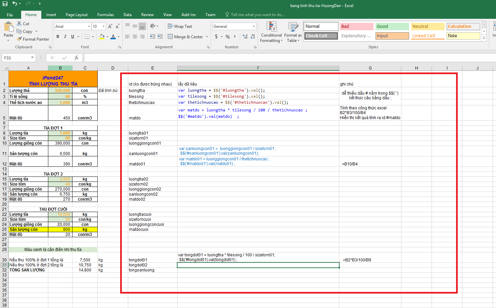

### Đặt id trên giao diện

- mỗi trường nhập liệu hoặc hiển thị kết quả đều cần có id riêng để phân biệt
    - ví dụ `<input type="number" id="luonggiongtha" placeholder="Lượng giống thả">` , id là `luonggiongtha
    - 

- lấy thông tin người dùng nhập vào lưu vào biến cùng tên id
    - cú pháp `$$('#id').val(); `
    - ví dụ `var luonggiongtha = $$('#luonggiongtha').val() ;`     

- tính toán công thức, kết quả lưu vào biến tương ứng 
    - ví dụ `tiLeSong = luongThucAnThucTe / (100 * luongThucAn / 80) * 100   ;`

- hiển thị thông tin ra giao diện bằng id tương ứng
    - cú pháp `$$('$id').val(bien_tuong_ung) `
    - ví dụ `$$('#tiLeSong').val(tiLeSong) ;`

### Hướng dẫn trong file exel
- xem file `bang tinh thu tia-HuongDan.xlsx`
- hình
